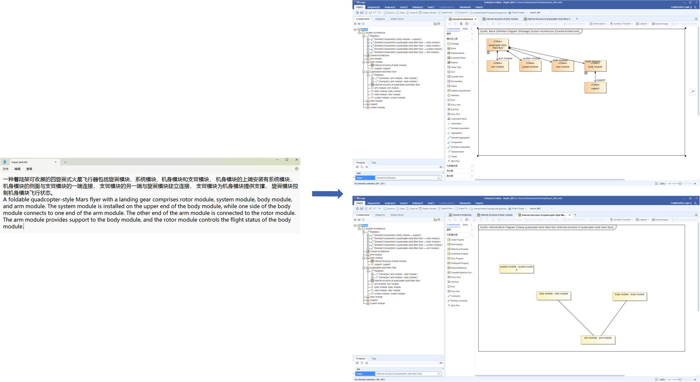
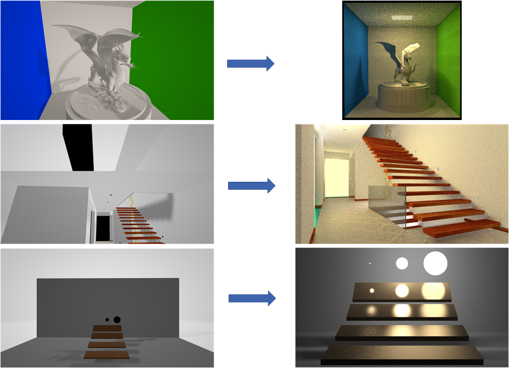

# 
Haomin Guo

I have got my undergraduate degree in Tianjin University in 2022, majoring in Engineering Management. Then I changed my major to Computer Science and Technology in Zhejiang University, where I'm a graduate of [State Key Lab of CAD&CG](http://www.cad.zju.edu.cn/english.html) now. 

My recent research is about Model-Based Systems Engineering ([MBSE](https://en.wikipedia.org/wiki/Model-based_systems_engineering))  using Artificial Intelligence, called AI4SE. 

My interests lie in Computer Vision, Computer Graphics, Natural Language Processing. And I have learned related courses and required relevant skills. 

Recently I'm preparing to apply for a Ph.D. in Computer Science in the fall of 2025. 

I would like to collaborate with you if you have any intriguing ideas. Let's create and do something interesting. 

Please contact me through email guohaomin888@163.com.

## EDUCATION

**Undergraduate, majoring in Engineering Management, College of Management and Economics, Tianjin University 2018.09-2022.07**

* GPA: 3.67/4.0
* Third Prize of National Mathematics Competition
* National Inspiration Scholarship (Twice)
* Third Prize of  the 10th “Jingjing Le Dao” Economic Hotspot Analysis Competition (organized by Tsinghua University)

**Graduate, majoring in Computer Science and Technology, College of Computer Science and Technology, Zhejiang University 2022.09-present**

* Laboratory: [State Key Lab of CAD&CG](http://www.cad.zju.edu.cn/english.html)
* Courses studied: Computer Graphics, Artificial Intelligence Algorithm and Systems, 3D CAD Modeling, Computer Animation and Applications, etc.
* Field: Model-Based Systems Engineering ([MBSE](https://en.wikipedia.org/wiki/Model-based_systems_engineering)), Deep learning, Natural Language Processing

## RESEARCH EXPERIENCE

**[State Key Lab of CAD&CG](http://www.cad.zju.edu.cn/english.html), Zhejiang University, Hangzhou, China 2022.09-present**

* GST: A framework to automatically generate SysML diagrams from text based on deep learning (submitted, manuscript is [here](./README.assets/manuscript.pdf))

  Specifically, I built a framework, based on deep learning, to generate [Systems modeling language](https://en.wikipedia.org/wiki/Systems_modeling_language)(SysML) diagrams automatically from unstructured natural language text without any involvement of user in the progress, which is the first attempt to apply deep learning to SysML diagrams generation. Our method can achieve a high degree of automation and the result can be import to the mainstream modeling software, allowing for subsequent modifications and additional modeling tasks.

  

## PROJECT

**Monte Carlo Ray Tracing Renderer**

[https://github.com/HaominGuo/Monte_Carlo_Ray_Tracing.git](https://github.com/HaominGuo/Monte_Carlo_Ray_Tracing.git)

Developed based on C++, using Monte Carlo Integration to implement Ray Tracing Rendering.

* Utilizes Axis-Aligned Bounding Box (AABB) and Bounding Volume Hierarchy (BVH) to accelerate intersection calculations.

* Utilizes local illumination models: Phong, Blinn-Phong, Microsurface.

* Makes use of Multiple Importance Sampling (MIS) to enhance robustness.

  

## ADDITIONAL SKILLS & INTERESTS

**CS, ML and DL**

I took additional machine learning and deep learning courses beyond the required curriculum, including Statistical Learning Methods, Dive into Deep Learning, Natural Language Processing with Deep Learning and Deep Learning for Computer Vision. Furthermore, I acquired proficiency in using PyTorch framework and get expertise in commonly used programming languages such as C++ and python.

**Cycle sport**

During my college years, I ride my road bicycle almost everyday to exercise and relax.
